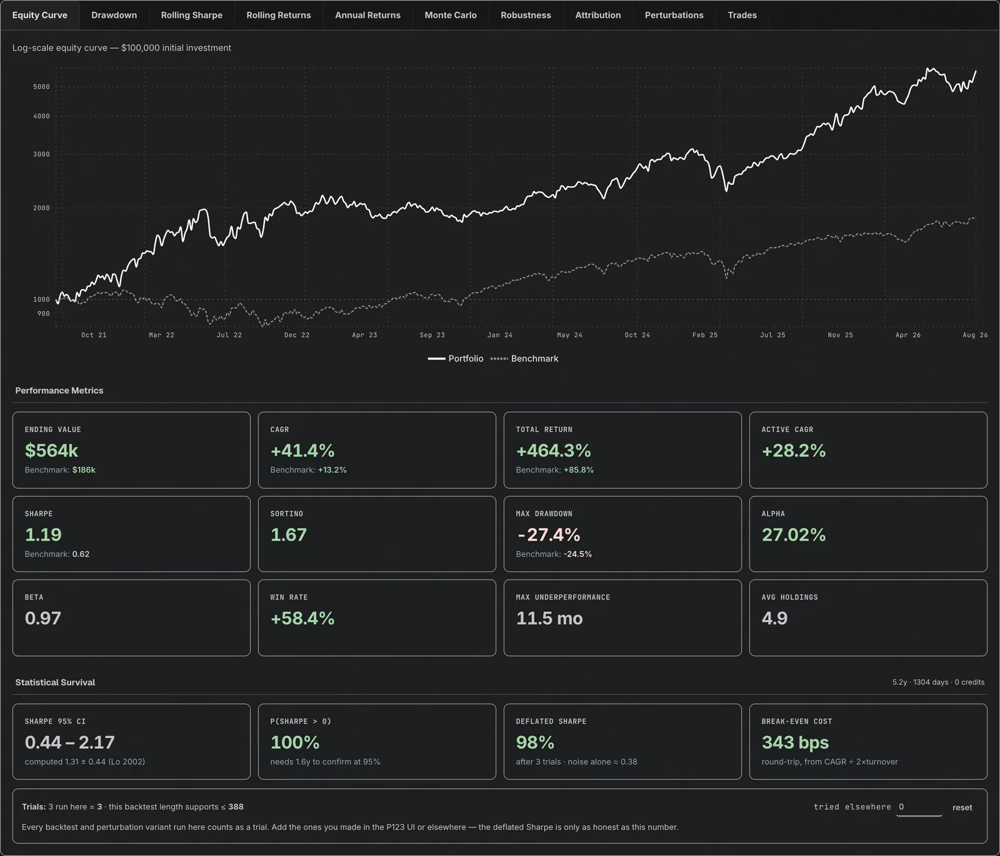
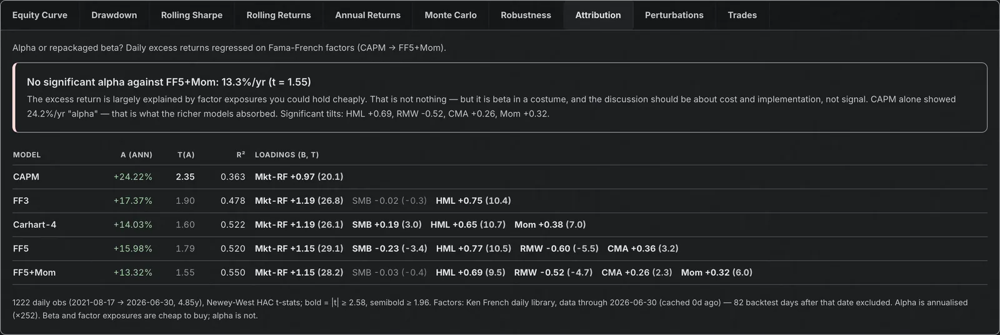
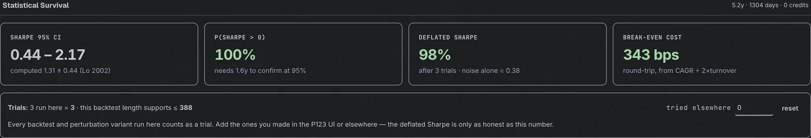
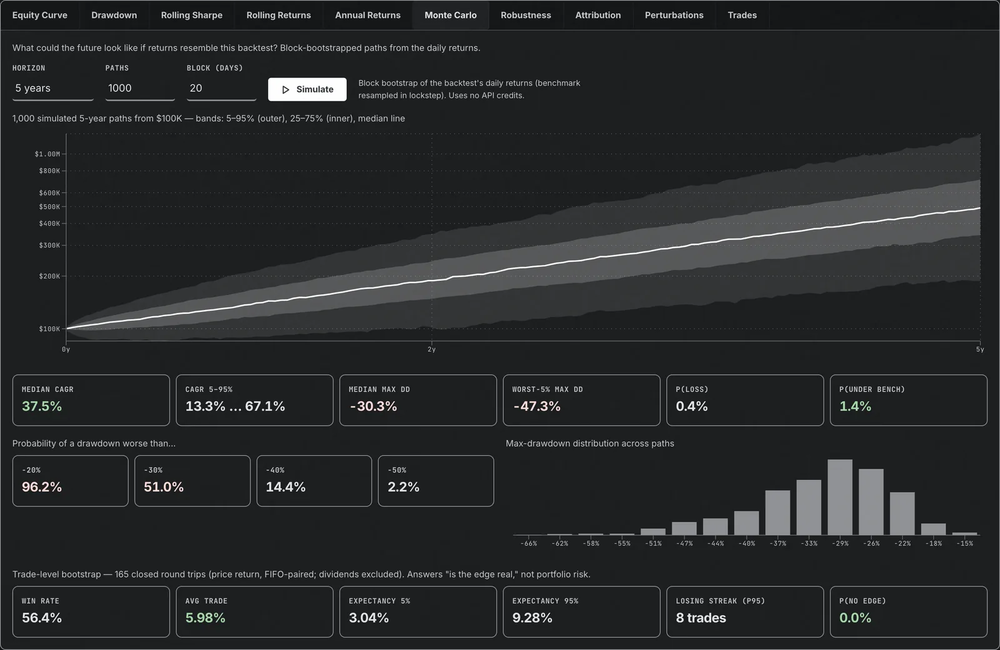
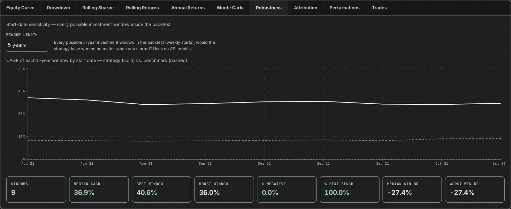
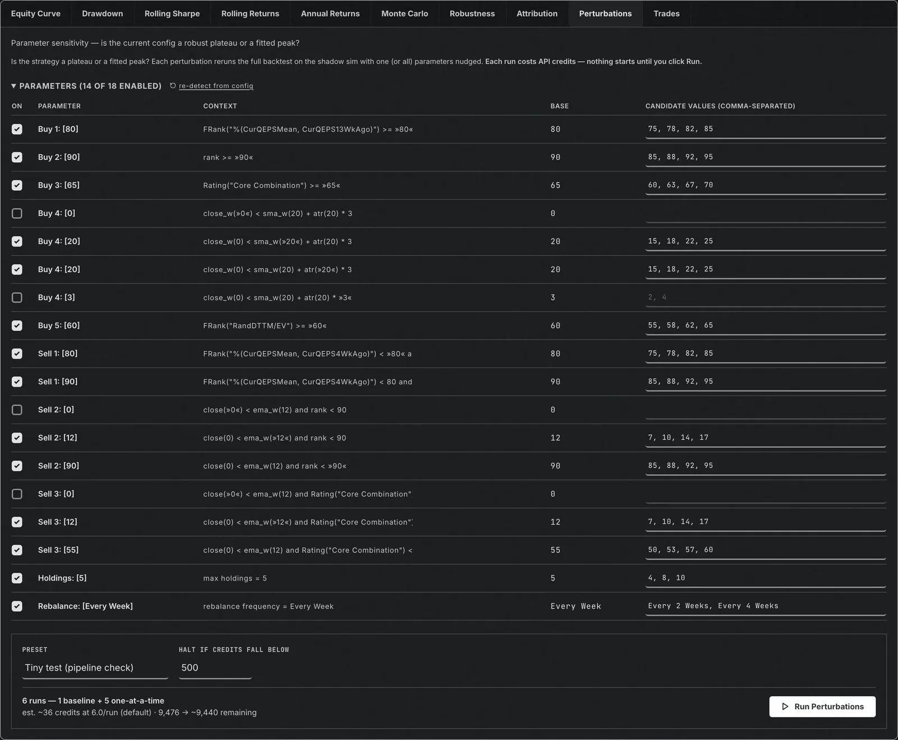
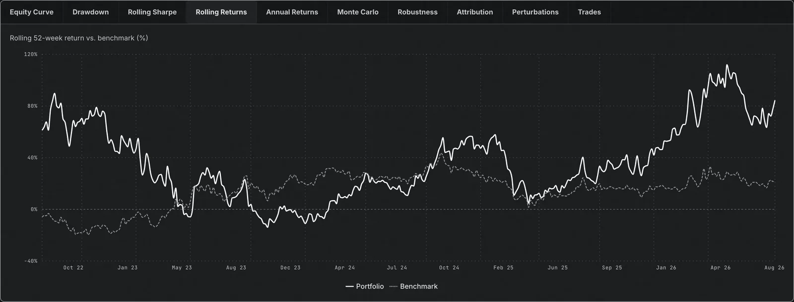
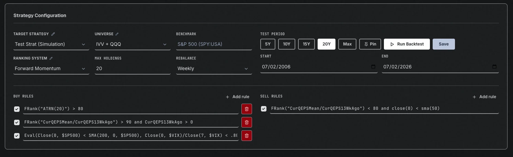

# P123 Strategy Lab

A self-hosted web dashboard for **testing Portfolio123 strategies safely**. Iterate on buy/sell
rules, universes, ranking systems, and rebalance settings against P123's simulation engine —
without modifying your real strategies — then commit a configuration back to Portfolio123 only
when you're happy with it.

Built with FastAPI + React (Vite, Tailwind, Recharts). Runs locally, in Docker, or on Google
Cloud Run behind IAP.



> Independent community project. Not affiliated with, sponsored by, or endorsed by
> Portfolio123, Inc. Nothing here is investment advice. Backtests are hypothetical and the tool
> **can rewrite strategies in your P123 account** — read [How the shadow sim works](#how-the-shadow-sim-works)
> before pointing it at anything you care about.

## Contents

- [Features](#features)
- [How the shadow sim works](#how-the-shadow-sim-works)
- [Quick start (local development)](#quick-start-local-development)
- [Run with Docker](#run-with-docker)
- [Deploy to Google Cloud Run](#deploy-to-google-cloud-run)
- [Configuration reference](#configuration-reference)
- [API quota notes](#api-quota-notes)
- [Security model](#security-model)
- [Repository layout](#repository-layout)
- [Development notes](#development-notes)
- [Credits](#credits)

## Features

- **Shadow-sim testing** — backtests are executed by rerunning a dedicated *scratch simulation*
  with your test configuration. Portfolio123's `rerun` API permanently rewrites a sim's
  definition, so running tests directly against a real strategy would corrupt it; the shadow
  sim absorbs that. Your real strategy is only written when you explicitly **Save/Commit**.
- **Verified formula autocomplete** — 4,800+ factors and functions with official descriptions
  and signatures, generated from an extraction of P123's Factor Reference (no invented names).
- **Full results suite** — log-scale equity curve, drawdown, rolling Sharpe/returns, annual
  returns, and the sim's actual transaction log.
- **Monte Carlo** — paired block bootstrap of the backtest's daily returns (benchmark resampled
  in lockstep, preserving correlation): percentile fan chart, CAGR and max-drawdown
  distributions, P(loss), P(underperforming the benchmark), drawdown-threshold probabilities,
  plus a trade-level bootstrap (FIFO round-trip pairing) for expectancy confidence intervals
  and losing-streak statistics. Costs zero API credits.
- **Statistical survival** — the tests the audit literature says to run and nobody does, all
  computed from the daily curve at zero API cost: Sharpe with Lo (2002) standard error and 95%
  CI, Probabilistic Sharpe (P(SR > 0)) and minimum track record, **Deflated Sharpe** against an
  honest **trial count** (the app counts every backtest and perturbation variant it runs, and
  you add the ones made elsewhere), minimum backtest length / max trials the window supports
  (Bailey & López de Prado), an autocorrelation warning, and **break-even round-trip cost in
  bps** from CAGR and turnover.
- **Factor attribution** — alpha or repackaged beta? Daily excess returns regressed on CAPM,
  FF3, Carhart-4, FF5 and FF5+Mom (Ken French daily library, Newey-West t-stats). Verdict line
  plus the full loadings table. Factor data is fetched on demand and cached (refreshed weekly,
  stale copy used if the fetch fails) — no scheduler needed. Zero API credits.
- **Robustness (rolling windows)** — every possible 3/5/10-year investment window inside the
  backtest, strategy vs. benchmark, answering "did this only work because of the start date?"
  Zero API credits.
- **Parameter perturbation (sensitivity analysis)** — one-at-a-time and joint variations of
  holdings, rebalance frequency, and numeric rule thresholds, run serially against the shadow
  sim with a quota floor and cancel button. Job history is persisted. Every variant counts
  toward the strategy's trial count, and each variant's daily return series is kept so the
  job reports a **Probability of Backtest Overfitting** (CSCV, Bailey et al. 2014) — how often
  the in-sample winner underperforms the median out of sample. Zero extra credits.
- **Run history** — the last 20 runs with config summaries and side-by-side metric comparison.
- **Live API quota meter** — every P123 response's `cost`/`quotaRemaining` is surfaced in the
  header, with a low-credit warning.
- **Durable state** — strategy/universe/ranking-system lists, settings and perturbation jobs
  persist to a GCS bucket (Cloud Run), a mounted volume (Docker), or local files (dev).

<details>
<summary>More screenshots</summary>

**Attribution** — alpha or repackaged beta? CAPM → FF5+Mom with Newey-West t-stats. Here a
24%/yr CAPM "alpha" shrinks to an insignificant 13% once value, profitability and momentum
are priced:



**Statistical survival** — Sharpe confidence interval, deflated Sharpe against the trial
count, and break-even trading cost:



**Monte Carlo** — block-bootstrapped forward paths with drawdown risk and trade-level edge stats:



**Robustness** — every rolling investment window, strategy vs. benchmark:



**Perturbations** — one-at-a-time and joint sensitivity sweeps on the shadow sim, with PBO
reported per job:



**Rolling returns** and the **strategy configuration** form with verified formula autocomplete:





</details>

## How the shadow sim works

Portfolio123's API cannot create strategies, and `POST /strategy/{id}/rerun` **permanently
changes** the target sim's configuration. The lab therefore uses one (or two) throwaway sims
that you create once in the P123 UI:

1. Create a new simulated strategy on Portfolio123 (any universe/rules — it will be
   overwritten constantly). Use **dynamic-weight** rebalancing (the default).
2. Open the app → Settings (gear icon) → paste the sim's ID as the **dynamic** shadow sim.
   The app verifies it is a plain Simulation (not a Book or Live Portfolio) before accepting it.
3. Optional: if any of your strategies use **static** position sizing (fixed weight %), create
   a second scratch sim with static sizing and add it too — the API cannot switch a sim's
   sizing method, so a matching shadow is needed for exact results.
4. **Match the transaction costs.** The rerun API cannot set slippage or commissions, so
   every test inherits the *shadow sim's* cost settings, not the target's. Set the shadow
   sim's slippage/commission on P123 to match the strategies you test — otherwise results are
   systematically flattered (or penalised) relative to the real sim.

Every backtest then runs on the shadow sim with your test config overriding everything;
**Save** is the only action that writes to the strategy you selected. If no shadow sim is
configured the app still lets you run a backtest but warns loudly that it modified the target
sim; perturbation jobs refuse to start at all without one.

## Quick start (local development)

Prerequisites: Python 3.11+ (3.12 recommended), [uv](https://docs.astral.sh/uv/), Node 20+,
and a Portfolio123 account with API access (Account Settings → API; paid feature).

```bash
git clone https://github.com/acombs/p123-strat-lab.git
cd p123-strat-lab
```

Backend (terminal 1):

```bash
cd backend
cp .env.example .env          # fill in P123_API_ID / P123_API_KEY
uv sync
uv run python -m uvicorn main:app --port 8000 --reload
```

Frontend (terminal 2; the Vite dev server proxies `/api` to `:8000`):

```bash
cd frontend
npm install
npm run dev                   # http://localhost:5173
```

Then open Settings and add your shadow sim ID, and add a strategy by ID with the ✎ next to
**Target strategy**. Local state (strategy list, settings, perturbation history) is stored as
JSON files in `backend/` — all gitignored.

## Run with Docker

Builds the frontend and serves everything from one container on `http://localhost:8080`:

```bash
cp backend/.env.example backend/.env    # fill in P123 credentials
docker compose up --build
```

State persists in `./data/` (gitignored). The port is deliberately bound to `127.0.0.1` — the
app has no login of its own, so anyone who can reach it can spend your API quota and rewrite
your strategies. Put an authenticating reverse proxy in front of it before exposing it further.

## Deploy to Google Cloud Run

The included script deploys behind **native IAP** so only the Google identity you name can
reach the app. Your P123 credentials are stored in **Secret Manager** and mounted into the
container as environment variables; the service runs under a dedicated least-privilege service
account with access only to its state bucket and those two secrets.

Prerequisites: the [gcloud CLI](https://cloud.google.com/sdk/docs/install), a GCP project with
billing enabled, and `gcloud auth login` as a project Owner/Editor.

```bash
cp deploy.env.example deploy.env      # set PROJECT and IAP_MEMBER
cp backend/.env.example backend/.env  # set P123 credentials (if not done already)
./deploy.sh
```

The script is idempotent — rerun it to redeploy after code or credential changes. It:

1. enables the Cloud Run, Cloud Build, Artifact Registry, Storage, Secret Manager and IAP APIs;
2. creates the runtime service account, the state bucket (public-access prevention on,
   seeded from any local `backend/*.json` on first run), and the Artifact Registry repo;
3. upserts the two credentials into Secret Manager (a new version only when the value changed);
4. builds the image with Cloud Build (source filtered by `.gcloudignore` — no `.env`, no local
   state) and deploys with `--no-allow-unauthenticated --iap`;
5. grants the IAP service agent `run.invoker` and `IAP_MEMBER` `iap.httpsResourceAccessor`.

Estimated cost: effectively free at personal usage levels (scale-to-zero, 512 MB instance,
a handful of small GCS objects, two secrets).

To tear it down: `gcloud run services delete p123-strategy-lab`, delete the two
`p123-strategy-lab-p123-api-*` secrets, the `<project>-p123-state` bucket, the Artifact
Registry repo, and the `p123-strategy-lab-sa` service account.

## Configuration reference

### `backend/.env` — runtime (local, Docker; copied to Secret Manager for Cloud Run)

| Variable | Required | Description |
|---|---|---|
| `P123_API_ID` | yes | Portfolio123 API ID (Account Settings → API) |
| `P123_API_KEY` | yes | Portfolio123 API key |
| `P123_STRATEGY_IDS` | no | Comma-separated strategy IDs to pre-populate the list on first start |
| `STATE_DIR` | no | Directory for local JSON state (default: `backend/`). docker-compose sets `/data` |
| `GCS_BUCKET` | no | If set, state lives in this bucket instead of files. Set by `deploy.sh` |
| `ENV` | no | `development` enables CORS for the Vite dev server; unset otherwise |

### `deploy.env` — deployment target (only read by `deploy.sh`)

| Variable | Required | Default | Description |
|---|---|---|---|
| `PROJECT` | yes | — | GCP project id |
| `IAP_MEMBER` | yes | — | Who may access the app, e.g. `user:you@example.com` or `group:team@example.com` |
| `SERVICE` | no | `p123-strategy-lab` | Cloud Run service name (also names the SA, secrets, AR repo) |
| `REGION` | no | `us-central1` | Cloud Run / bucket / AR region |
| `STATE_BUCKET` | no | `<PROJECT>-p123-state` | GCS bucket for app state |
| `AR_REPO` | no | `<SERVICE>` | Artifact Registry repository |
| `SA_NAME` | no | `<SERVICE>-sa` | Runtime service account name |

### In-app settings (gear icon)

Shadow sim IDs (dynamic and optional static). Stored with the rest of the app state, never in
the repo.

## API quota notes

- Each backtest is one `rerun` + one results fetch (typically ~30–50 credits depending on the
  period). Monte Carlo, Robustness, and run-history comparisons consume **no** credits; the
  Trades tab and trade-level Monte Carlo stats use one cached transactions fetch.
- Attribution, PBO, Statistical Survival, Monte Carlo and Robustness never call P123.
- Perturbation jobs cost one backtest per variant. They stop automatically when the quota
  meter falls below the floor you set (default 500), after two consecutive failures, or when
  you press cancel. A baseline identical to the previous job's is reused rather than rerun.
- P123 allows one in-flight API request per key; the backend serializes all calls.
- The header meter always shows the credits remaining in your billing month.

## Security model

- **The app has no authentication of its own.** Locally it binds to localhost; in Docker the
  port is published on `127.0.0.1` only; on Cloud Run, IAP authenticates every request before
  it reaches the container and the service refuses unauthenticated traffic. Do not expose the
  backend directly to a network — whoever reaches it holds your P123 key.
- Credentials are read only from `backend/.env` (local/Docker) or Secret-Manager-backed env vars
  (Cloud Run). They are never logged, never returned by any endpoint, and never sent to the
  browser; the frontend only talks to the backend's `/api/*` routes.
- `.gitignore`, `.dockerignore` and `.gcloudignore` all exclude `.env`, `deploy.env`, and
  the local state JSON, so neither the repo, the image, nor the Cloud Build source upload
  contains them.
- User state (your strategy IDs/names, shadow-sim settings, perturbation history) is
  gitignored — a fresh clone starts with safe defaults.
- Writes to Portfolio123 happen only on the shadow sim (backtests, perturbations) or when you
  explicitly Save/Commit to the selected strategy.

Found a security issue? Please open a private security advisory on GitHub rather than a
public issue.

## Repository layout

```
backend/
  main.py                  # FastAPI app: P123 client, shadow-sim flow, analytics, perturbations
  survival.py              # Sharpe SE/CI, PSR, deflated Sharpe, MinTRL/MinBTL, break-even
  factors.py               # Ken French fetch/cache + Fama-French HAC attribution
  pbo.py                   # CSCV probability of backtest overfitting
  storage.py               # GCS / STATE_DIR / local JSON state persistence
  generate_autocomplete.py # builds p123_autocomplete.json from the P123 skill's references
  p123_autocomplete.json   # verified formula dictionary served to the frontend
  .env.example             # runtime config template
frontend/
  src/App.tsx              # state, run/commit flows, history
  src/components/          # form, results tabs (charts, MC, robustness, perturbations, trades), modals
Dockerfile                 # two-stage build: Vite dist → FastAPI static serving
docker-compose.yml         # single-container local run, state on ./data
deploy.sh                  # Cloud Run + IAP + Secret Manager + state-bucket deployment
deploy.env.example         # deployment target template
.github/workflows/ci.yml   # typecheck + build on push/PR
```

## Development notes

- **Regenerating the formula autocomplete.** `backend/p123_autocomplete.json` ships
  pre-generated. To regenerate it you need the reference files from the
  [Portfolio123 Claude skill](https://quantsolvings.com/insights/free-portfolio123-claude-skill/)
  by QuantSolvings ([repo](https://github.com/acombs/p123-skill)) — an extraction-verified copy
  of P123's Factor Reference:

  ```bash
  python backend/generate_autocomplete.py /path/to/p123-skill/references
  ```

- **Universes.** All of P123's built-in universes (S&P 500/400/600/1500, Russell 1000/2000/3000,
  DJIA, NASDAQ 100, cap tiers, All Stocks/All Fundamentals/No OTC, exchanges, MLPs, ADRs) are
  pre-populated from `BUILTIN_UNIVERSES` in `backend/main.py`. Custom universes are addressed
  by their (negative) P123 UID and auto-register when a strategy that uses one is loaded; you
  can also add them by ID in the Universes modal. When loading a strategy the app maps P123's
  `universeUid`/name back to a code via `BUILTIN_UNIVERSE_UIDS` (observed built-in UIDs) and
  the alias table — if you spot a built-in universe that comes back unmapped, add its UID or
  name alias there.
- **CI** runs `tsc` + Vite build and imports the FastAPI app with dummy credentials.

## Credits

- **Formula autocomplete dictionary** (`backend/p123_autocomplete.json`) is generated from the
  reference files of the free [Portfolio123 Claude skill](https://quantsolvings.com/insights/free-portfolio123-claude-skill/)
  by **QuantSolvings** ([source](https://github.com/acombs/p123-skill), MIT, © 2026 QuantSolvings)
  — an extraction-verified copy of P123's Factor Reference. Hat tip for making that available.

## License

MIT — see [LICENSE](LICENSE). The bundled autocomplete data is derived from the QuantSolvings
skill above under its MIT license.
